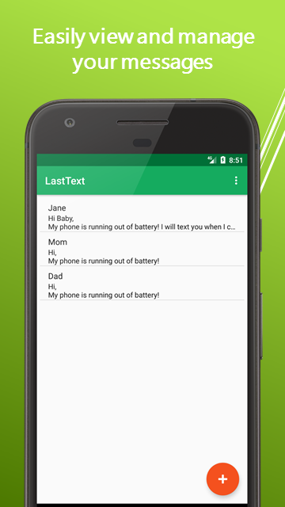
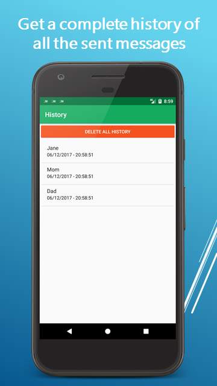
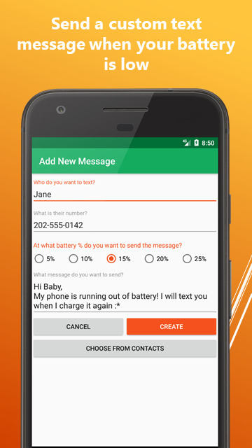

# LastText

### Note: This project was last tested and updated on 2017-06-22

## What's LastText?
If you think not having signal can get people worried, try running out of battery and not telling anyone about it! LastText solves this problem by automatically texting your contacts before your phone runs out of battery. You can create custom text messages to be sent automatically at a specific battery percentage. For even more control, you can disable auto messaging temporarily. You can also view a complete history of all the sent messages. 

LastText can save your loved ones from worries by sending the last text!

## Screenshots

## License

LastText is open-sourced software licensed under the MIT license.